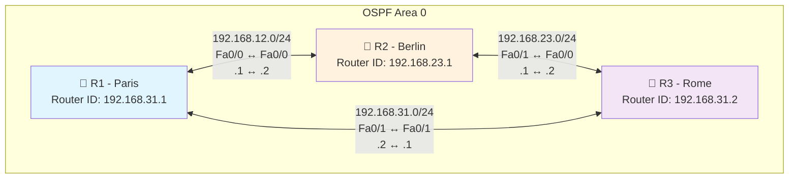
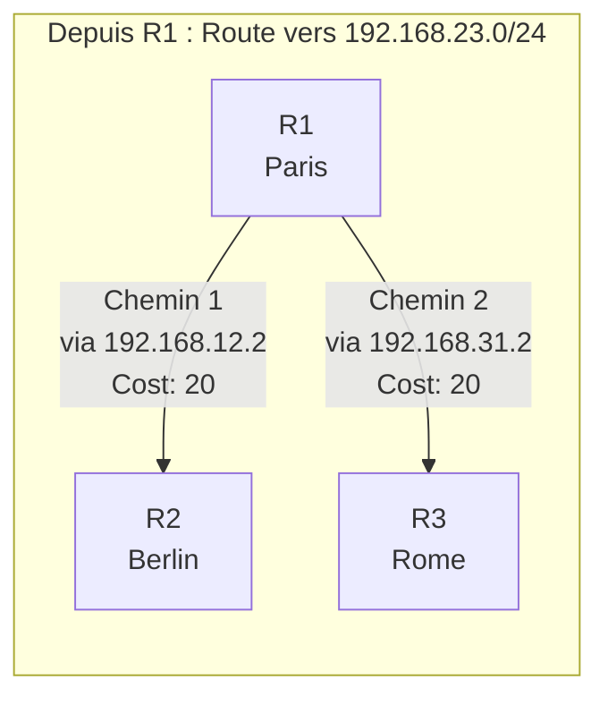
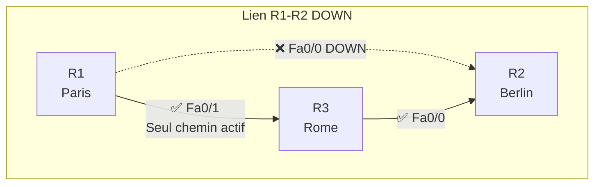
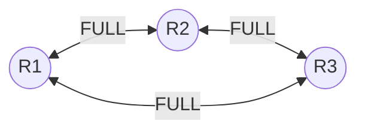

# Schéma Topologie OSPF

#networking #ospf #gns3 #jedha

---

## Topologie Triangle



---

## Schéma ASCII (alternative)

```
                    ┌─────────────────────┐
                    │   R1 - PARIS        │
                    │   Fa0/0: 192.168.12.1│
                    │   Fa0/1: 192.168.31.1│
                    └─────────┬───────────┘
                             │
              Fa0/0          │          Fa0/1
        192.168.12.0/24      │     192.168.31.0/24
                             │
           ┌─────────────────┴─────────────────┐
           │                                   │
           ▼                                   ▼
┌──────────────────────┐           ┌──────────────────────┐
│   R2 - BERLIN        │           │   R3 - ROME          │
│   Fa0/0: 192.168.12.2│           │   Fa0/0: 192.168.23.2│
│   Fa0/1: 192.168.23.1│           │   Fa0/1: 192.168.31.2│
└──────────┬───────────┘           └───────────┬──────────┘
           │                                   │
           │         192.168.23.0/24           │
           │           Fa0/1 ↔ Fa0/0           │
           └───────────────────────────────────┘
```

---

## Tableau d'adressage IP

| Routeur | Site | Interface | Adresse IP | Sous-réseau | Voisin |
|---------|------|-----------|------------|-------------|--------|
| R1 | Paris | Fa0/0 | 192.168.12.1/24 | 192.168.12.0/24 | R2 |
| R1 | Paris | Fa0/1 | 192.168.31.1/24 | 192.168.31.0/24 | R3 |
| R2 | Berlin | Fa0/0 | 192.168.12.2/24 | 192.168.12.0/24 | R1 |
| R2 | Berlin | Fa0/1 | 192.168.23.1/24 | 192.168.23.0/24 | R3 |
| R3 | Rome | Fa0/0 | 192.168.23.2/24 | 192.168.23.0/24 | R2 |
| R3 | Rome | Fa0/1 | 192.168.31.2/24 | 192.168.31.0/24 | R1 |

---

## Sous-réseaux

| Sous-réseau | Lien | Description |
|-------------|------|-------------|
| 192.168.12.0/24 | R1 ↔ R2 | Paris - Berlin |
| 192.168.23.0/24 | R2 ↔ R3 | Berlin - Rome |
| 192.168.31.0/24 | R3 ↔ R1 | Rome - Paris |

---

## Chemins OSPF (Load Balancing ECMP)



### Tableau des chemins depuis R1

| Destination | Chemin | Via (Next-Hop) | Interface | Coût |
|-------------|--------|----------------|-----------|------|
| 192.168.23.0/24 | 1 | 192.168.12.2 (R2) | Fa0/0 | 20 |
| 192.168.23.0/24 | 2 | 192.168.31.2 (R3) | Fa0/1 | 20 |

→ **ECMP** (Equal-Cost Multi-Path) : Les 2 chemins ont le même coût, donc les deux sont utilisés !

---

## Redondance - Scénario de panne



### Avant la panne (2 chemins)
```
O  192.168.23.0/24 [110/20] via 192.168.12.2, Fa0/0
                   [110/20] via 192.168.31.2, Fa0/1
```

### Après la panne (1 chemin)
```
O  192.168.23.0/24 [110/20] via 192.168.31.2, Fa0/1
```

→ OSPF reconverge automatiquement !

---

## Relations de voisinage OSPF



| Routeur | Voisin 1 | Voisin 2 |
|---------|----------|----------|
| R1 | R2 (via Fa0/0) | R3 (via Fa0/1) |
| R2 | R1 (via Fa0/0) | R3 (via Fa0/1) |
| R3 | R2 (via Fa0/0) | R1 (via Fa0/1) |

---

*Dernière mise à jour : Février 2026*
